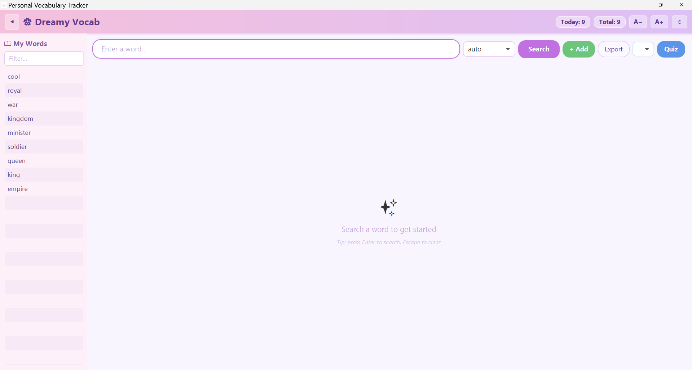

# Personal Vocabulary Tracker

A desktop application for looking up, saving, and reviewing English word definitions — all in one clean window.



---

## Features

### Core
- **Instant definitions** — look up any word via Merriam-Webster, Wiktionary, or auto-select the best source
- **Personal word list** — words are saved automatically to a local SQLite database on first lookup
- **Manual word entry** — add any word with a custom definition using the **+ Add** button (no internet needed)
- **Daily & total counters** — see how many words you've added today and in total
- **Day streak** — header badge shows your consecutive-day learning streak (🔥)
- **Smart suggestions** — get related word suggestions when a word isn't found

### Quiz
- **Multiple-choice quiz** — practice your last learned words with 4-option questions
- **Configurable quiz size** — choose 5, 10, 15, or 20 questions per session
- **Retry missed words** — instantly re-quiz only the words you got wrong
- **Quiz history** — recent session scores shown inside the quiz panel

### Productivity
- **Export vocabulary** — save your full word list as `.txt` or `.csv` via the Export button
- **Edit definitions** — correct or expand any saved meaning inline
- **Text-to-speech** — hear the word pronounced (🔊 button, Windows only)
- **Zoom support** — `Ctrl +` / `Ctrl −` or the A+ / A− buttons to scale the entire UI
- **Sidebar filter** — quickly find any saved word in the side panel
- **Fully offline after first run** — saved words are always available without internet

---

## Download

Go to the [**Releases**](../../releases/latest) page and download **`VocabTracker-Setup.exe`**.  
Run the installer — no Java or Python installation needed.

**Requirements:** Windows 10/11 (64-bit)

---

## Tech Stack

| Layer | Technology |
|-------|------------|
| UI | Java 21 + JavaFX 17 |
| Backend | Python 3 (PyInstaller bundle) |
| IPC | JSON over stdin/stdout (`PythonBridge`) |
| Database | SQLite (stored in `%APPDATA%\PersonalVocabTracker`) |
| Dictionary sources | Merriam-Webster API, Wiktionary API |
| Installer | Inno Setup 6 |

---

## Building from Source

See [docs/Development.md](docs/Development.md) for the full build guide.

Quick summary:

```bash
# 1. Build the Java fat JAR
mvn package -DskipTests

# 2. Bundle the Python backend
pip install pyinstaller requests
pyinstaller backend.spec
pyinstaller "Vocabulary Tracker.spec"

# 3. Copy artifacts and build installer
#    (requires Inno Setup 6 installed)
iscc installer.iss
```

---

## Documentation

| Page | Description |
|------|-------------|
| [Installation](docs/Installation.md) | Step-by-step install guide |
| [Usage](docs/Usage.md) | How to use the app |
| [Development](docs/Development.md) | Build & contribute guide |

---

## Changelog

### v2.0 — March 2026
- Added **+ Add Word** button for manual word entry with custom definitions
- Added **Export** — save full vocabulary as `.txt` or `.csv`
- Added **day streak badge** (🔥) in header
- Added **configurable quiz size** (5 / 10 / 15 / 20 questions)
- Increased default UI zoom for better readability
- Fixed quiz panel staying on screen after completion (added ✕ close button)
- Fixed suggestion list layout (was hidden behind text area)
- Fixed empty state colliding with quiz pane layout
- Removed non-functional separator from header
- Quiz icon replaced with universally-supported character

### v1.0 — Initial release
- Word lookup (Merriam-Webster, Wiktionary, auto)
- Save, edit, delete words
- Multiple-choice quiz with retry
- Text-to-speech, zoom, sidebar word list
---

## Contributors

- **Surya Teja** — Backend (Python)
- **Akhila** — Frontend (Java)

---

## License

This project is for personal use. Feel free to fork and adapt it.
